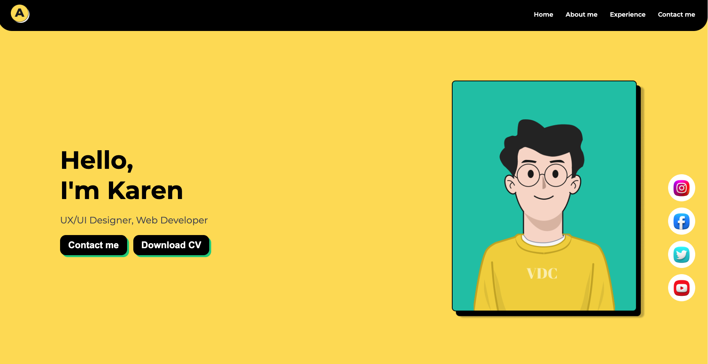

# 🎨 Test Portfolio v1

This project is the **first version** of my personal portfolio. It was created as a practice exercise to strengthen my skills in **HTML** and **CSS**, focusing on building a clean layout and improving my visual styling techniques.

## 🚀 Features
- Basic HTML and CSS structure
- Simple and clean design

## 🛠 Technologies Used
- **HTML5** – structure and content
- **CSS3** – styling and layout

## 📌 Project Status
Completed (Version 1) – created for learning purposes, with notes for future improvements

## Screeen 

